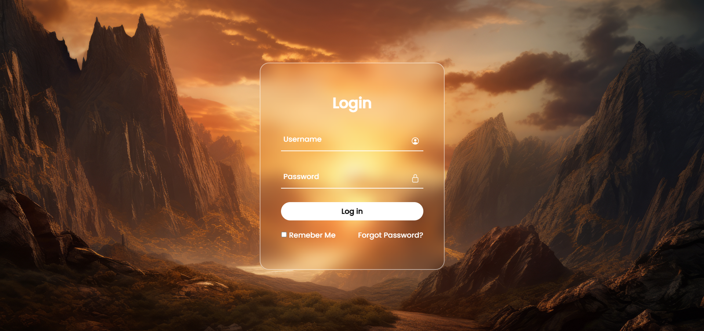

# Login Form

Login Form Built Using HTML, CSS and JavaScript.



## Table of Contents
- [About](#about)
- [Features](#features)
- [Preview](#preview)
- [Getting Started](#getting-started)
- [Project Structure](#project-structure)
- [Technologies](#technologies)
- [Credits](#credits)

## About

This repository contains a simple, responsive login form created with plain HTML, CSS, and JavaScript. It's designed as a lightweight front-end example suitable for learning or quick inclusion in projects that need an elegant login UI.

## Features

- Clean, modern login UI
- Responsive layout for desktop and mobile
- Client-side input validation with JavaScript
- Easy to customize styles and assets

## Preview

The screenshot below shows the login form as rendered in a browser:


## Getting Started

To run the project locally:

1. Clone the repository:

   ```bash
   git clone https://github.com/BinaryVortex/Login-Form-80.git
   cd Login-Form-80
   ```

2. Open `index.html` in your browser (double-click the file or run a local server).

3. Optionally edit `style.css` and `index.html` to customize the look and behavior.

## Project Structure

- index.html - The login form markup
- style.css - Styles for layout and visual design
- Screenshot 2024-07-31 080723.png - Screenshot used in this README
- mythical-video-game-inspired-landscape-with-mountains.jpg - Background/illustration asset

## Technologies

- HTML
- CSS
- JavaScript

## Credits

Created by BinaryVortex.

---

If you'd like, I can also:
- Add a live demo link (GitHub Pages) and configure publishing.
- Improve accessibility (labels, ARIA attributes) and keyboard support.
- Add unit tests or a simple server-side authentication example.

